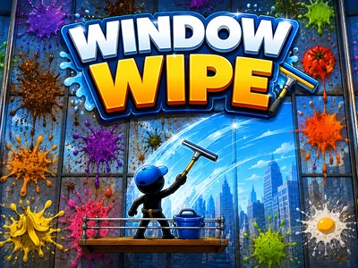
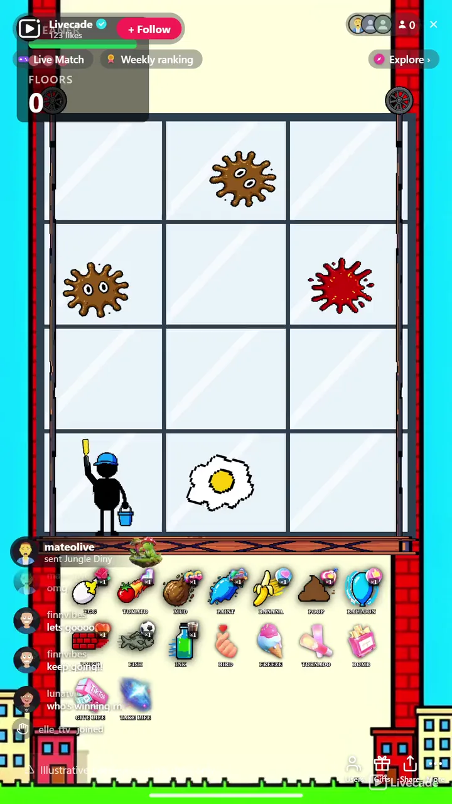

# Window Wipe - Interactive TikTok Live Game

> You clean the window, your chat destroys it.

You clean a skyscraper window while your whole chat throws mess at it. Eggs, tomatoes, paint, and poop splat the glass, hazards like the bomb, tornado, and bird pile on, and every dirty pane drains your HP. Clean panes to climb floors and survive.

**[Play Window Wipe on Livecade](https://livecade.io/games/window-wipe/?utm_source=github&utm_medium=readme&utm_campaign=window-wipe)** - runs as a single browser source in OBS, Streamlabs, or TikTok LIVE Studio. Nothing for viewers to install.

## How viewers play

Viewers take part with the actions TikTok already gives them: **gifts**, **comments**, **likes**. Every action below is rebindable, so you decide which interaction drives which effect.

| Action | What it does |
| --- | --- |
| **Throw mess (per throwable)** | Splats the glass with one of ten throwables, each with its own splat art. Bigger gifts hit more panes at once |
| **Bomb** | Explodes on the window, stunning the cleaner and blasting a chunk of HP |
| **Freeze** | Ices the cleaner solid for a few seconds so the mess piles up |
| **Tornado** | Sweeps across the window, scrambling every column it passes |
| **Bird** | Flies along a row, dropping a mess on every pane |
| **Give a life / Take a life** | The run's pivot: a big gift hands the cleaner an extra life, or rips one away |

## How it works

### The chat makes the mess

Viewers throw ten different things at the glass, from eggs and tomatoes to bricks, fish, and ink. Bigger gifts splat a bigger blob of panes at once, and every throwable comes pre-wired to a gift so the game works out of the box.

### You are the only cleaner

Click a pane to squeegee it yourself, or let the cleaner wipe on auto while you talk. Dirty glass drains your HP, cleaning pays it back, so keeping up with the chat is a real tug-of-war you can win.

### Survive the hazards, climb the floors

A bomb stuns you, a freeze ices you solid, a tornado scrambles the columns, and a bird poops down a whole row. Losing all HP costs a life, and the floors you clean are the score, with an optional goal and a reward you promise for hitting it.

## About the game

Window Wipe puts you on a scaffold against your entire chat. A 3 by 4 grid of window panes fills the screen, and viewers only ever make mess: ten different throwables, from eggs and tomatoes to mud, paint, bananas, poop, water balloons, bricks, fish and ink, each splatting the glass in its own way. Bigger gifts splat a bigger contiguous blob of panes.

### Four hazards escalate the chaos

A bomb that stuns you and blasts HP, a freeze that ices you solid, a tornado that sweeps across scrambling every column it passes, and a bird that flies a row dropping a mess on every pane.

### A tug of war you can actually win

You are the only cleaning force: click a pane to squeegee it yourself or let the cleaner wipe on auto, and every pane you clear pays HP back. Dirty glass drains your HP, losing it all costs a life, and the run ends when your lives run out.

### Never looks dead between gifts

Floors cleaned is the score, with an optional goal counter and a reward you promise the chat for hitting it. Demo throws keep the window lively when nobody is gifting, and the overlay chrome runs in twelve languages.

## What it looks like on stream

[Watch Window Wipe gameplay](https://cdn.livecade.io/games/window-wipe.mp4)

## What you can configure

- **Interface language** - Twelve languages for the on-screen chrome
- **Cleaning mode** - Click panes to wipe them yourself, or let the cleaner run on auto
- **Auto wipe tempo** - How many panes per second the auto cleaner clears
- **Wipe speed** - How long one pane takes to squeegee clean
- **Difficulty** - How fast mess drains your HP, from relaxed to brutal
- **Lives per run** - Losing all HP costs a life and refills the bar. The run ends at zero lives
- **Goal and reward** - Show a floors target with a promise you make the chat for hitting it
- **Demo throws** - Synthetic throws keep the window lively when nobody is gifting, stopping the moment a real viewer throws

## Languages

English, Spanish, Portuguese, French, German, Italian, Indonesian, Arabic, Turkish, Russian, Hindi, Romanian

## FAQ

<strong>How do viewers interact with Window Wipe?</strong>

Viewers send gifts to throw mess at the window, ten different throwables from eggs to ink, plus hazards like the bomb, tornado, freeze, and bird. Every action is rebindable to gifts, comments, likes, follows, or shares, and it ships with a full set of gift bindings so it works out of the box.

<strong>Do I play it or does it run itself?</strong>

Both are options. In manual mode you click each pane to squeegee it, so it is a skill game against your chat. In auto mode the cleaner wipes on its own while you talk, and the show becomes how hard your viewers can bury it.

<strong>Can the chat actually make me lose?</strong>

Yes. Dirty panes drain your HP and hazards hit it directly, while cleaning pays HP back. Losing all HP costs a life and the run ends when your lives run out, and a big gift can even rip a life away, so a determined chat can genuinely end the run.

<strong>How do I add Window Wipe to my TikTok Live?</strong>

Add one browser source URL to OBS or your streaming software and go live. There is no plugin to install and nothing for your viewers to download.

## Setup

1. [Create a Livecade account](https://app.livecade.io/register?utm_source=github&utm_medium=cta&utm_campaign=window-wipe)
2. Copy your overlay browser source URL
3. Paste it into OBS, Streamlabs, or TikTok LIVE Studio
4. Pick Window Wipe, set your triggers, and go live

Runs in the browser, so it works on Windows and macOS with nothing to download. [See all TikTok Live games](https://livecade.io/tiktok-live-games/?utm_source=github&utm_medium=readme&utm_campaign=window-wipe).

---

_This repository documents Window Wipe, a hosted interactive game by [Livecade](https://livecade.io/?utm_source=github&utm_medium=footer&utm_campaign=window-wipe). The game runs on Livecade's platform, so there is no source to install here._
